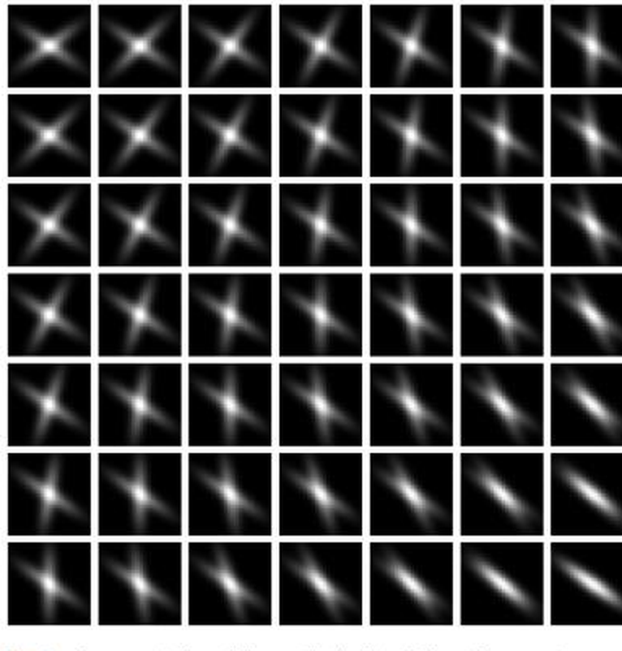

# TV–Wasserstein for the reconstruction of the EAP

**Notes**

$\mathcal K$ is the stacked saddle-point operator (the draft calls it $L$), kept notationally distinct from the forward operator $K=UF$; $Q$ is the **Beckmann flux**, not a Kantorovich coupling; $\mathbb J=\mathbb J^{*}$.

---

## 0. Notation

| Symbol                                           | Meaning                                                                                                                                 |
| ------------------------------------------------ | --------------------------------------------------------------------------------------------------------------------------------------- |
| ${X},\ Y$                                        | spatial domain / displacement (q-space) domain, discrete grids                                                                          |
| $P:{X}\times Y\to\mathbb R$                      | EAP field (primal variable); a tensor $P\in\mathbb R^{m_1\times m_2\times n_1\times n_2}$; physically $P\ge 0$                          |
| $K=UF$                                           | undersampled Fourier operator; $F$ the unitary 6-D DFT, $U$ a binary sampling mask. Generally **not injective** ($\ker K\neq\{0\}$)     |
| $\mathcal K$                                     | stacked saddle-point operator (distinct from $K$)                                                                                       |
| $E$                                              | measured, undersampled, noisy data                                                                                                      |
| $Q$                                              | Beckmann flux / momentum field (primal)                                                                                                 |
| $f,\,g$                                          | dual variables ($f$ = transport potential, $g$ = mass-TV dual)                                                                          |
| $\mathbb I,\ \mathbb J$                          | $\mathbb I P=\sum_i P_i$ (total mass); $\mathbb J=\mathrm{Id}-\tfrac1N\mathbb I^{*}\mathbb I$ (zero-mean projection), applied per voxel |
| $\alpha_1,\alpha_2>0$                            | transport weight / mass-TV weight                                                                                                       |
| $\nabla_{X},\ \nabla_Y$                          | forward-difference gradients in the spatial / displacement variables (homogeneous Neumann BC)                                           |
| $\operatorname{div}_\bullet=-\nabla_\bullet^{*}$ | discrete divergence                                                                                                                     |
| $\|Q\|_{2,1}=\sum_i\|Q_i\|_2$                    | Group_lasso: this notation does not provide which axis (axes) are involved in the 2-norm and must be understood from the context.       |
| $\mathcal I_S$                                   | indicator function of the set $S$                                                                                                       |

---

## 1. What we reconstruct: the EAP array

The target is the **Ensemble Average Propagator** $\bar P(x,r)$: the probability that a water
molecule at voxel $x\in\mathbb R^3$ undergoes displacement $r\in\mathbb R^3$. Folding in the spin
density $\rho(x)$, the reconstructed object is the **weighted** displacement distribution

$ P(x,r):=\rho(x)\,\bar{P}(x,r),\qquad P:{X}\times Y\to\mathbb{R}_{\ge0} . $

On discrete grids this is a 4-tensor $P\in\mathbb R^{m_1\times m_2\times n_1\times n_2}$ (2-D used
for notational convenience; nothing changes in 3-D + 3-D). $P(x, \cdot)$ is a **map valued in a space of functions** - one displacement PDF per voxel - which is exactly the structure the regularizer below is built to exploit.

The attached figure shows a synthetic instance: a $7\times7$ grid of voxels, each holding a
**mixture of two oriented Gaussians** in $Y$ (a crossing-fiber profile). One component is fixed across voxels; the second rotates spatially. This is the kind of array $P$ the method manipulates.

We remark that $x$ indicates the position of a *voxel*.

## 2. Forward model

The scanner measures, in joint $(k,q)$-space, the 6-D Fourier transform of $P$, undersampled and noisy:

$E = U\big(F(P)\big) + \eta \;=\; K(P) + \eta,\qquad K=UF .$

Undersampling in **both** $k$ and $q$ makes the inverse problem strongly ill-posed; $K$ is, of course, generally non-injective.

> **▷ Why this matters downstream.** $\ker K\neq\{0\}$ implies that in the dualized fidelity term it surfaces as a range/kernel indicator (a seminorm over $\ker K$), which is the third blow-up handled in the surrogate-gap construction. Worth flagging here so the forward model and the stopping-criterion analysis stay aligned.

---

## 3. Regularizer - Optimal-Transport TV

### 3.1 Generalized TV on a metric space

Classical TV $\int_{X}\|\nabla f\|\,dx$ promotes piecewise-constant solutions. For an EAP - a map
into a space of PDFs - replace the pointwise difference by a **distance $d$ between neighbouring voxel distributions**. In the anisotropic discrete case,

$\mathrm{TV}_d(P)=\sum_{(i,j)\in{X}} d(P_{i+1,j},P_{ij}) + d(P_{i,j+1},P_{ij}).$

The choice $d(P_1,P_2)=\|P_2-P_1\|_1$ is a "group-$L^1$-TV". Here $d$ is derived from the **1-Wasserstein distance** $W_1$, which respects the geometry of displacements rather than comparing PDFs bin-by-bin.

### 3.2 The unbalanced distance $\hat W_1^{\alpha_1,\alpha_2}$

$W_1$ requires equal masses. Since the EAP is non-normalized, the draft proposes the mass-splitting distance: for measures $P_1,P_2$ on $Y$,

$\hat W_1^{\alpha_1,\alpha_2}(P_1,P_2)=\alpha_1\,W_1\!\big(\mathbb J P_1,\mathbb J P_2\big)
+\alpha_2\,\big|\mathbb I P_1-\mathbb I P_2\big|,$

i.e. transport between the **mass-normalized** parts ($\mathbb J$ voxelwise subtracts the mean so the masses agree) plus a penalty on the **mass difference** ($\mathbb I$ = total mass).

Two stated advantages: it **coincides with $W_1$ on probability measures** (a property the Vogt–Lellmann unbalanced-$W_1$ does not have), and it **shrinks one dual variable** ($g$), lightening the saddle problem.

> **▷ Where it sits among unbalanced-OT models.** $\hat W_1$ is a hard split into "shape" (via $W_1$ on $\mathbb J P$) and "mass" (via $|\mathbb I P|$), as opposed to soft KL-relaxations (Wasserstein–Fisher–Rao / unbalanced Sinkhorn). The hard split is what makes the exact-on-probabilities property hold and keeps everything inside the $W_1$ linear-programming machinery - convenient for the Beckmann/flux reformulation in §5.

### 3.3 Kantorovich–Rubinstein dual

$W_1$ admits the Kantorovich-Rubinstein dual

$W_1(P_1,P_2)=\max_{\mathrm{Lip}(f)\le1}\int_Y f(y)\big(P_2(y)-P_1(y)\big)\,dy,
\qquad \mathrm{Lip}(f)\le1\iff\|\nabla f\|_\infty\le1 .$

The constraint is **local** (a gradient bound), and the dual variable $f$ has the **same size** as $P$, versus the quadratic size of a transport plan $\gamma$ - the numerical reason for using this dual formulation.

Moreover, the value of the max is invariant under additive constants in the dual variable ($f\mapsto f+c, \ c \text{ constant}$. For this reason, we will force a condition of the type $"f(0)=0"$, in the following. This does not change the problem and will come in handy. We write this condition as $\delta f =0$, where $\delta$ checks the value of $f$ in 0 (i.e. in an entry when an array).

### 3.4 Splitting the regularizer

Applying $\mathbb I,\mathbb J$ (which act per-voxel), the OT-TV splits exactly into a transport part and a
mass-TV part:

$\boxed{\;\mathrm{TV}^{\alpha_1,\alpha_2}_{\hat W_1}(P)
=\alpha_1\,\mathrm{TV}_{W_1}\!\big(\mathbb J P\big)+\alpha_2\,\mathrm{TV}\!\big(\mathbb I P\big)\;}$

Dualizing each piece:

$\mathrm{TV}_{W_1}(\mathbb J P)=\max_{\substack{\|\nabla_Y f\|_{2,\infty}\le1 \\ \delta f =0}}\langle\nabla_{X}\mathbb J P,\,f\rangle,
\qquad
\mathrm{TV}(\mathbb I P)=\|\nabla\mathbb I P\|_1=\max_{\|g\|_\infty\le1}\langle\nabla\mathbb I P,\,g\rangle,$

with the mixed norm $\|\nabla_Y f\|_{2,\infty}=\max_{(i,j),(k,l)}\max\{|(\nabla_Y f^1)_{ijkl}|,|(\nabla_Y f^2)_{ijkl}|\}$.

---

## 4. Variational problem

$\boxed{\;\min_{P:{X}\times Y\to\mathbb R}\ \tfrac12\|K(P)-E\|^2
\;+\;\alpha_1\,\mathrm{TV}_{W_1}\!\big(\mathbb J P\big)\;+\;\alpha_2\,\mathrm{TV}\!\big(\mathbb I P\big)\;}$

Squared-$L^2$ fidelity + OT-TV.

---

## 5. Saddle-point reformulation

Cast into the standard first-order form $\displaystyle\min_x\max_u\ F(x)-G(u)+\langle\mathcal K x,u\rangle$.
Dualizing the Lipschitz ball of $f$ introduces the **Beckmann flux** $Q$ (with $\alpha_1\|Q\|_{2,1}$);
$g$ is the mass-TV dual. The result, with primal $x=(P,Q)$ and dual $u=(f,g)$:

$\min_{P,Q}\ \max_{f,g}\quad
\underbrace{\tfrac12\|K P-E\|^2+\alpha_1\|Q\|_{2,1}}_{F(P,Q)}
\;-\big(\;\underbrace{\mathcal I_0(\delta f) + \mathcal I_{B_\infty}\!\big(\tfrac1{\alpha_2}g\big)\big)}_{G(f,g)}
\;+\;\langle\nabla_{X}\mathbb J P,\,f\rangle+\langle\operatorname{div}_Y Q,\,f\rangle+\langle\nabla\mathbb I P,\,g\rangle .$

The coupling operator and its adjoint are:

$\mathcal K=\begin{pmatrix}\nabla_{X}\mathbb J & \operatorname{div}_Y\\[2pt]\nabla\mathbb I & 0\end{pmatrix},
\qquad
\mathcal K^{*}=-\begin{pmatrix}\mathbb J\operatorname{div}_{X} & \mathbb I^{*}\operatorname{div}\\[2pt]\nabla_Y & 0\end{pmatrix}
\quad(\text{using }\mathbb J=\mathbb J^{*}).$

> **▷ Beckmann / continuity-equation reading.** The $f$-maximization is finite only on the affine set where the flux balances the spatial gradient of the normalized mass; at optimality $\nabla_{X}\mathbb J P+\operatorname{div}_Y Q=0$. Equivalently, $\mathrm{TV}_{W_1}(\mathbb J P)$ is the **minimum-flux (Beckmann) problem** $\min_Q\{\alpha_1\|Q\|_{2,1}:\operatorname{div}_Y Q=-\nabla_X\mathbb J P\}$.
> Eliminating $f$ turns that balance into the indicator $\mathcal I_0(\nabla_X\mathbb J P+\operatorname{div}_Y Q)$
> 
> - the primal blow-up term in the gap-surrogate notes. So $Q$ here *is* the variable those notes bound.

(\*\*) Note that we have ****not** enforced positivity of the EAP, here. If we do, we get a slightly different problem

$$
\min_{P,Q}\ \max_{f,g}\quad
\underbrace{\mathcal I_{\ge0}(P)+ \tfrac12\|K P-E\|^2+\alpha_1\|Q\|_{2,1}}_{F(P,Q)}
\;-\big(\;\underbrace{\mathcal I_0(\delta f) + \mathcal I_{B_\infty}\!\big(\tfrac1{\alpha_2}g\big)\big)}_{G(f,g)}
\;+\;\langle\nabla_{X}\mathbb J P,\,f\rangle+\langle\operatorname{div}_Y Q,\,f\rangle+\langle\nabla\mathbb I P,\,g\rangle .
$$

which not solvable in a straightforward way (i.e. via Chambolle-Pock).

---

## 6. Proximal algorithms

Now, we will use Chambolle-Pock. But the final version will employ Graph-Douglas-Rachford.

Iterate, with $\tau\sigma\|\mathcal K\|^2\le1$ and over-relaxation $\rho^{(i)}=1$:

$$
\begin{aligned}
x^{(i+\frac12)}&=\operatorname{prox}_{\tau F}\big(x^{(i)}-\tau\,\mathcal K^{*}u^{(i)}\big),\\
u^{(i+\frac12)}&=\operatorname{prox}_{\sigma G}\big(u^{(i)}+\sigma\,\mathcal K(2x^{(i+\frac12)}-x^{(i)})\big),\\
x^{(i+1)}&=x^{(i)}+\rho^{(i)}\big(x^{(i+\frac12)}-x^{(i)}\big),\qquad
u^{(i+1)}=u^{(i)}+\rho^{(i)}\big(u^{(i+\frac12)}-u^{(i)}\big).
\end{aligned}
$$

$F$ separates over $(P,Q)$, so the prox splits:

**Fidelity (resolvent in Fourier).** Since $K=UF$ with $F$ unitary,

$\operatorname{prox}_{\frac\tau2\|K(\cdot)-E\|^2}(P)=(\mathrm{id}+\tau K^{*}K)^{-1}\big(P-\tau K^{*}E\big),$

and $\mathrm{id}+\tau K^{*}K=F^{*}(\mathrm{id}+\tau U^{*}U)F$, so one solves the **diagonal** system
$(\mathrm{id}+\tau U^{*}U)\,F(x)=F\big(P-\tau K^{*}E\big)$ - entrywise, no iterative inner solve.

**Flux (group soft-threshold).**

$\operatorname{prox}_{\tau\alpha_1\|\cdot\|_{2,1}}(Q)_i=\frac{Q_i}{|Q_i|}\,\max\big(|Q_i|-\tau\alpha_1,\,0\big).$

**Mass-TV dual (projection).**

$\operatorname{prox}_{\sigma\,\mathcal I_{B_\infty}}(g)=\operatorname{proj}_{B_\infty}(g)\quad(\text{clip to }[-1,1]).$

The transport potential $f$ carries no prox term (it pairs through $\mathcal K$ only).

> **▷ Solver is interchangeable.** The saddle form is what matters; Chambolle–Pock is one choice. The project's preconditioned **graph Douglas–Rachford** route attacks the same
> 
> $\min_x\max_u F-G+\langle\mathcal K x,u\rangle$,
> 
> which is the more natural setting for a computable primal–dual gap. Swapping solvers does not touch §§1–5.

---

## 7. Experiments (synthetic)

**Crossing-fiber phantom.** Ground truth $P^\dagger$ of shape $7\times7\times30\times30$ (the
attached array). q-space undersampling via a binary mask on the displacement frequencies of
$F(P^\dagger)$, **shared across all voxels $(i,j)$**, retaining $20\%$ of components drawn from a
variable-density Gaussian centred at the q-space origin. Data $E=U(F(P^\dagger))+\eta$ with i.i.d.
$\eta\sim\mathcal N(0,\sigma^2)$, $\sigma=0.01\cdot\max_i|E_i|$. The unregularized baseline is the
Moore–Penrose pseudoinverse $F^{*}(U^{*}E)$; the OT-TV reconstruction recovers the crossing pattern
where the pseudoinverse is dominated by noise.

**Semi-realistic crossing fibers.** Sub-voxel crossings from standard diffusion-modeling software
with prescribed orientations and volume fractions, then sub-sampled and noised; evaluated by visual
inspection and angular error / RMSE / sparsity structure.

---

## Others

- **Related articles**
  
  - *Vogt & Lellmann (2017), OT-based restoration for Q-ball imaging* - origin of the OT-TV-on-PDFs
    idea and the framework this draft adapts; uses a different unbalanced $\widetilde W_1$.
  - *Sun, Sakhaee, Entezari & Vemuri (2015), EAP-sparsity CS for MS-HARDI in $(k,q)$-space* - TV-type regularization with a surfacelet sparsity prior; uses $L^1$-TV as the inter-voxel distance $d$.
  - *Schwab, Vidal & Charon (2017), $(k,q)$-compressed sensing with joint spatial–angular sparsity* - the joint $(k,q)$ undersampling setting, sparsity (not transport) prior.

- The transport term sees only the **shape** of each voxel PDF and the mass term sees only its **integral**.

- 
